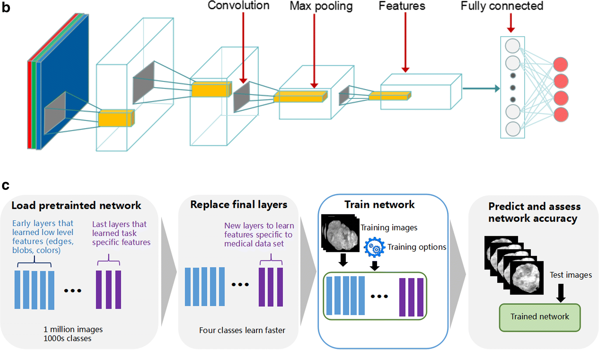

# Covid19_Detection_ResNet50

This project is aimed at covid19 detection using pretrained ResNet50 model. The [datset](https://www.kaggle.com/tawsifurrahman/covid19-radiography-database) used is sourced from Kaggle.
I am able to acheive the accuracy of more than 85%. The project follows the following architecture,

